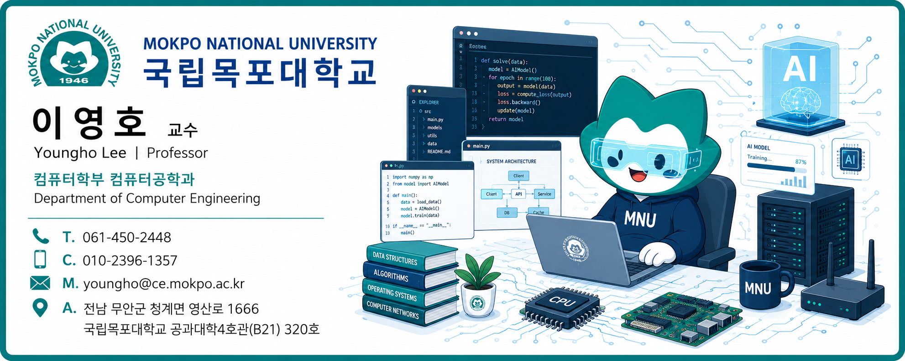

# AI활용코딩연습(ZBE135)

> **AI활용코딩연습(ZBE135)**  
> 이영호 교수 · 국립목포대학교 컴퓨터학부  
> 문의: [youngho@ce.mokpo.ac.kr](mailto:youngho@ce.mokpo.ac.kr)

[](https://www.python.org/)
[](https://colab.research.google.com/)
[](https://marp.app/)
[](course/15-week-plan.md)

- 생성형 AI를 **정답 생성기**가 아니라 문제 해결을 돕는 **학습 파트너**로 활용하며 Python을 배우는 15주 정규 교과목입니다. 학생은 AI가 제안한 코드를 직접 읽고, 실행하고, 검증하고, 수정하는 과정을 반복합니다. Python 핵심 문법부터 객체지향 프로그래밍, NumPy, pandas, 데이터 시각화, AI 기반 디버깅·리팩토링, 재현 가능한 데이터 분석 프로젝트까지 단계적으로 학습합니다. 
- 본 교과목은  국립목포대학교 AI부트캠프사업단 초급과정입니다. **AI활용프로그래밍**교과목을 이수한 학생만 수강하시기 바랍니다. 

## 교과목 개요

| 항목 | 내용 |
|---|---|
| 교과목명 | AI활용코딩연습(ZBE135)|
| 영문명 | AI-Assisted Python coding(ZBE135) |
| 운영 기간 | 15시간 (1학점) |
| 기본 수업 | 주 1시간: 핵심 이론, 안내 실습, 독립 실습, 피드백 |
| 확장 수업 | 주 2시간: 확장 과제, 동료 코드 리뷰, 프로젝트 클리닉 추가 |
| 선수 학습 | `AI활용프로그래밍` 이수 또는 Python 기초 |
| 실습 환경 | Google Colab, GitHub, 생성형 AI |
| 주요 평가 | 주차별 실습·과제, 중간 실기 프로젝트, 최종 데이터 분석 프로젝트 |

## 학습 목표

수강생은 교과목을 이수한 뒤 다음을 수행할 수 있습니다.

1. Python의 변수, 자료형, 조건문, 반복문, 자료구조와 함수를 활용해 문제를 해결합니다.
2. 파일·CSV·예외 처리와 객체지향 설계를 적용해 프로그램을 구조화합니다.
3. NumPy와 pandas로 데이터를 불러오고 정제·변환·집계·분석합니다.
4. matplotlib으로 분석 결과를 목적에 맞게 시각화하고 설명합니다.
5. 생성형 AI가 만든 코드의 정확성, 안전성, 가독성을 검증하고 개선합니다.
6. 실행 가능한 노트북, 데이터, 분석 과정과 결론을 갖춘 재현 가능한 프로젝트를 완성합니다.

## 수업 시작하기

### 학생

1. 아래 표에서 해당 주차의 **주차 안내**를 읽습니다.
2. **Colab 실습**을 열어 위에서 아래 순서로 실행합니다.
3. 쉬운 예제를 이해한 뒤 기본·응용·도전 문제로 이동합니다.
4. **과제**와 **AI 활용 기록**을 함께 제출합니다.
5. **퀴즈**로 핵심 개념을 점검합니다.

### 교수자

1. [15주 수업 운영계획](course/15-week-plan.md)과 [학습성과·평가계획](course/outcomes-and-assessment.md)을 확인합니다.
2. [슬라이드–노트북 연계표](course/slide-notebook-map.md)에 따라 강의와 실습을 운영합니다.
3. [교수자 운영 가이드](instructor/operation-guide.md)와 [퀴즈 정답](instructor/quiz-answer-key.md)을 활용합니다.
4. 배포 전 `python scripts/validate_package.py --execute`로 전체 노트북을 검증합니다.

## 15주 강의자료

| 주차 | 핵심 주제 | 수업자료 | Colab | 과제·퀴즈 |
|---:|---|---|---|---|
| 1 | AI 협업 코딩과 Colab 시작 | [안내](weeks/week01/README.md) · [슬라이드](weeks/week01/slides.md) | [실습 열기](https://colab.research.google.com/github/MNU-AI-Programming/AI-Assisted-Python-Programming/blob/main/weeks/week01/practice.ipynb) | [과제](weeks/week01/assignment.md) · [퀴즈](weeks/week01/quiz.md) |
| 2 | 입력·계산·문자열 | [안내](weeks/week02/README.md) · [슬라이드](weeks/week02/slides.md) | [실습 열기](https://colab.research.google.com/github/MNU-AI-Programming/AI-Assisted-Python-Programming/blob/main/weeks/week02/practice.ipynb) | [과제](weeks/week02/assignment.md) · [퀴즈](weeks/week02/quiz.md) |
| 3 | 조건문과 반복문 | [안내](weeks/week03/README.md) · [슬라이드](weeks/week03/slides.md) | [실습 열기](https://colab.research.google.com/github/MNU-AI-Programming/AI-Assisted-Python-Programming/blob/main/weeks/week03/practice.ipynb) | [과제](weeks/week03/assignment.md) · [퀴즈](weeks/week03/quiz.md) |
| 4 | 리스트·튜플·집합·딕셔너리 | [안내](weeks/week04/README.md) · [슬라이드](weeks/week04/slides.md) | [실습 열기](https://colab.research.google.com/github/MNU-AI-Programming/AI-Assisted-Python-Programming/blob/main/weeks/week04/practice.ipynb) | [과제](weeks/week04/assignment.md) · [퀴즈](weeks/week04/quiz.md) |
| 5 | 함수·모듈·테스트 가능한 코드 | [안내](weeks/week05/README.md) · [슬라이드](weeks/week05/slides.md) | [실습 열기](https://colab.research.google.com/github/MNU-AI-Programming/AI-Assisted-Python-Programming/blob/main/weeks/week05/practice.ipynb) | [과제](weeks/week05/assignment.md) · [퀴즈](weeks/week05/quiz.md) |
| 6 | 파일·CSV·예외 처리 | [안내](weeks/week06/README.md) · [슬라이드](weeks/week06/slides.md) | [실습 열기](https://colab.research.google.com/github/MNU-AI-Programming/AI-Assisted-Python-Programming/blob/main/weeks/week06/practice.ipynb) | [과제](weeks/week06/assignment.md) · [퀴즈](weeks/week06/quiz.md) |
| 7 | 클래스와 객체지향 설계 | [안내](weeks/week07/README.md) · [슬라이드](weeks/week07/slides.md) | [실습 열기](https://colab.research.google.com/github/MNU-AI-Programming/AI-Assisted-Python-Programming/blob/main/weeks/week07/practice.ipynb) | [과제](weeks/week07/assignment.md) · [퀴즈](weeks/week07/quiz.md) |
| 8 | 중간 실기: Python 문제 해결 | [안내](weeks/week08/README.md) · [슬라이드](weeks/week08/slides.md) | [실습 열기](https://colab.research.google.com/github/MNU-AI-Programming/AI-Assisted-Python-Programming/blob/main/weeks/week08/practice.ipynb) | [과제](weeks/week08/assignment.md) · [퀴즈](weeks/week08/quiz.md) |
| 9 | NumPy와 배열 사고 | [안내](weeks/week09/README.md) · [슬라이드](weeks/week09/slides.md) | [실습 열기](https://colab.research.google.com/github/MNU-AI-Programming/AI-Assisted-Python-Programming/blob/main/weeks/week09/practice.ipynb) | [과제](weeks/week09/assignment.md) · [퀴즈](weeks/week09/quiz.md) |
| 10 | pandas 데이터 불러오기·탐색 | [안내](weeks/week10/README.md) · [슬라이드](weeks/week10/slides.md) | [실습 열기](https://colab.research.google.com/github/MNU-AI-Programming/AI-Assisted-Python-Programming/blob/main/weeks/week10/practice.ipynb) | [과제](weeks/week10/assignment.md) · [퀴즈](weeks/week10/quiz.md) |
| 11 | 데이터 정제·변환·집계 | [안내](weeks/week11/README.md) · [슬라이드](weeks/week11/slides.md) | [실습 열기](https://colab.research.google.com/github/MNU-AI-Programming/AI-Assisted-Python-Programming/blob/main/weeks/week11/practice.ipynb) | [과제](weeks/week11/assignment.md) · [퀴즈](weeks/week11/quiz.md) |
| 12 | 탐색적 데이터 분석·프로젝트 기획 | [안내](weeks/week12/README.md) · [슬라이드](weeks/week12/slides.md) | [실습 열기](https://colab.research.google.com/github/MNU-AI-Programming/AI-Assisted-Python-Programming/blob/main/weeks/week12/practice.ipynb) | [과제](weeks/week12/assignment.md) · [퀴즈](weeks/week12/quiz.md) |
| 13 | matplotlib 데이터 시각화 | [안내](weeks/week13/README.md) · [슬라이드](weeks/week13/slides.md) | [실습 열기](https://colab.research.google.com/github/MNU-AI-Programming/AI-Assisted-Python-Programming/blob/main/weeks/week13/practice.ipynb) | [과제](weeks/week13/assignment.md) · [퀴즈](weeks/week13/quiz.md) |
| 14 | AI 디버깅·테스트·리팩토링 | [안내](weeks/week14/README.md) · [슬라이드](weeks/week14/slides.md) | [실습 열기](https://colab.research.google.com/github/MNU-AI-Programming/AI-Assisted-Python-Programming/blob/main/weeks/week14/practice.ipynb) | [과제](weeks/week14/assignment.md) · [퀴즈](weeks/week14/quiz.md) |
| 15 | 최종 프로젝트 발표와 재현성 | [안내](weeks/week15/README.md) · [슬라이드](weeks/week15/slides.md) | [실습 열기](https://colab.research.google.com/github/MNU-AI-Programming/AI-Assisted-Python-Programming/blob/main/weeks/week15/practice.ipynb) | [과제](weeks/week15/assignment.md) · [퀴즈](weeks/week15/quiz.md) |

각 주차 슬라이드에는 개념 이해를 돕는 SVG 순서도가 포함되어 있으며, 원본은 [`assets/diagrams`](assets/diagrams/)에서 확인할 수 있습니다.

## 프로젝트와 평가

| 구분 | 안내 | 평가 기준 |
|---|---|---|
| 주차별 과제 | 각 주차 `assignment.md` | [주차별 과제 루브릭](rubrics/weekly-assignment-rubric.md) |
| 중간 프로젝트 | [Python 문제 해결 프로젝트](projects/midterm-project.md) | [중간 프로젝트 루브릭](rubrics/midterm-rubric.md) |
| 최종 프로젝트 | [재현 가능한 데이터 분석 프로젝트](projects/final-project.md) | [최종 프로젝트 루브릭](rubrics/final-project-rubric.md) |

제출할 때는 [학생 제출 템플릿](templates/student-submission-template.md)과 [AI 활용 기록지](templates/ai-use-log.md)를 사용합니다. 전체 산출물은 [주차별 산출물 체크리스트](course/deliverables-checklist.md)에서 확인할 수 있습니다.

## 데이터셋

| 파일 | 주요 활용 |
|---|---|
| [`scores.csv`](datasets/scores.csv) | 성적 데이터 탐색·집계 |
| [`expenses.csv`](datasets/expenses.csv) | 지출 데이터 분류·분석 |
| [`books.csv`](datasets/books.csv) | 조건 검색·정렬·요약 |
| [`survey.csv`](datasets/survey.csv) | 결측치·중복·범주 정제 |

데이터는 수업을 위해 만든 가상 데이터입니다. 자세한 설명은 [데이터셋 안내](datasets/README.md)를 참고합니다.

## 저장소 구조

```text
AI-Assisted-Python-Programming/
├── course/                 # 15주 운영계획, 학습성과, 산출물, 연계표
├── weeks/week01~week15/    # 안내, Colab, Marp 슬라이드, 과제, 퀴즈
├── assets/diagrams/        # 주차별 SVG 개념도·순서도
├── datasets/               # 수업용 CSV 데이터
├── projects/               # 중간·최종 프로젝트 안내
├── rubrics/                # 주차·중간·최종 평가 기준
├── templates/              # 학생 제출 및 AI 활용 기록 양식
├── instructor/             # 교수자 운영 가이드와 퀴즈 정답
├── scripts/                # 패키지·노트북 자동 검증
├── old/                    # 개편 이전 Chapter 기반 강의자료
├── 2026_여름학기/          # 2026년 여름학기 공지·과제
├── README.md
├── SUMMARY.md
└── requirements.txt
```

## 실습 환경 설정

대부분의 실습은 별도 설치 없이 Google Colab에서 실행할 수 있습니다. 로컬 환경에서 실행하려면 다음 명령을 사용합니다.

```bash
git clone https://github.com/MNU-AI-Programming/AI-Assisted-Python-Programming.git
cd AI-Assisted-Python-Programming
python -m venv .venv
source .venv/bin/activate  # Windows: .venv\Scripts\activate
python -m pip install -r requirements.txt
```

전체 노트북 구조와 실행 가능 여부를 검사하려면 다음 명령을 실행합니다.

```bash
python scripts/validate_package.py --execute
```

## 생성형 AI 활용 원칙

- AI가 만든 코드는 그대로 제출하지 않고 반드시 직접 실행하고 설명합니다.
- 사용한 프롬프트, 채택한 제안, 직접 수정한 부분과 수정 이유를 기록합니다.
- 정상 사례뿐 아니라 경계값과 오류 사례도 함께 검증합니다.
- AI의 설명과 코드가 과제 요구사항 및 실행 결과와 일치하는지 확인합니다.
- 개인정보, 비밀번호, API 키와 타인의 결과물을 저장소에 올리지 않습니다.
- 최종 결과에 대한 책임은 AI가 아니라 제출자에게 있습니다.

## 기존 자료와 여름학기 자료

- 개편 이전의 Chapter 기반 강의자료는 [`old/`](old/)에 보존되어 있습니다.
- 2026년 여름학기 공지와 과제는 [`2026_여름학기/`](2026_여름학기/)에서 확인할 수 있습니다.
- 현재 정규학기 수업은 루트의 `course/`, `weeks/`, `projects/` 자료를 기준으로 운영합니다.

## 라이선스 및 이용

이 저장소의 자료는 국립목포대학교 「AI활용코딩연습(ZBE135)」 수업을 위해 제작되었습니다. 외부 활용·수정·재배포 시에는 저장소의 라이선스와 출처 표시 조건을 먼저 확인해 주세요.

---

**담당 교수:** 이영호 · 국립목포대학교 컴퓨터학부  
**GitHub:** [MNU-AI-Programming/AI-Assisted-Python-Programming](https://github.com/MNU-AI-Programming/AI-Assisted-Python-Programming)

