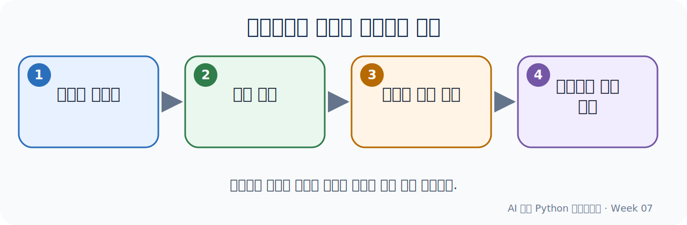

# Week 07
## 클래스와 객체지향 설계

이영호 교수 | 국립목포대학교 컴퓨터학부

---

# 오늘의 목표와 산출물

- 핵심 개념: class, 객체, 속성, 메서드, 생성자, 캡슐화, 책임 분리
- 실습: **도서 대출 관리 클래스**
- 산출물: **상태와 동작을 함께 관리하는 클래스**

---

# Colab 실습 지도

| 단계 | 슬라이드 | 노트북 | 학생 활동 |
|---|---:|---|---|
| 개념 그림 | 5 | 흐름 안내 | 코드가 처리되는 순서 설명 |
| Level 1 따라하기 | 6~8 | 첫 코드 셀 | 예상 → 실행 → 한 곳 변경 |
| Level 2 바꾸기 | 9~10 | 핵심 코드 셀 | 값·조건 두 곳 변경 |
| Level 3 적용하기 | 11~12 | 도전 코드 셀 | 정상·경계 사례 테스트 |
| Level 4 확장하기 | 13~15 | 확장 코드 셀 | 기능 설계·AI 기록 |

[이번 주 Colab 열기](https://colab.research.google.com/github/MNU-AI-Programming/AI-Assisted-Python-Programming/blob/main/weeks/week07/practice.ipynb)

---

# 핵심 개념 연결

- class
- 객체
- 속성
- 메서드
- 생성자
- 캡슐화
- 책임 분리

---

# 개념 순서도



---

# Level 1 — 먼저 예측하기

## 가장 쉬운 코드부터 시작합니다

1. 코드를 아직 실행하지 않습니다.
2. 각 줄의 역할과 출력 결과를 예상합니다.
3. 예상 내용을 옆 학생에게 한 문장으로 설명합니다.

---

# Level 1 — 따라하기

```python
class Student:
    def __init__(self, name):
        self.name = name

student = Student("서연")
print(student.name)
```

**실행 전 질문:** 어떤 값이 출력될까요?

---

# Level 1 — 한 곳만 바꾸기

1. 숫자 또는 문자열 **한 곳**을 찾습니다.
2. 값을 바꾸면 어떤 출력이 나올지 먼저 적습니다.
3. Colab에서 실행하여 예상과 비교합니다.

> 설명 문장: “___을 ___로 바꾸었기 때문에 결과가 ___로 달라졌다.”

---

# Level 2 — 핵심 코드 읽기

```python
class Book:
    def __init__(self, title, author):
        self.title = title
        self.author = author
        self.is_borrowed = False

    def borrow(self):
        if self.is_borrowed:
            return False
        self.is_borrowed = True
        return True

    def return_book(self):
        self.is_borrowed = False

book = Book("AI 시대의 Python", "MNU")
assert book.borrow() is True
assert book.borrow() is False
book.return_book()
print(book.title, book.is_borrowed)
```

코드의 **입력 → 처리 → 출력** 부분을 각각 표시하세요.

---

# Level 2 — 두 곳 바꾸기

- 입력값·조건·데이터 중 한 곳을 변경합니다.
- 계산·함수·집계 방식 중 한 곳을 변경합니다.
- 변경 전후 결과를 표로 기록합니다.

| 구분 | 변경 전 | 변경 후 | 달라진 이유 |
|---|---|---|---|
| 실행 결과 |  |  |  |

---

# Level 3 — 문제에 적용하기

```python
class ExpenseBook:
    def __init__(self):
        self.items = []

    def add(self, category, amount):
        self.items.append({"category": category, "amount": amount})

    def total(self):
        return sum(item["amount"] for item in self.items)

ledger = ExpenseBook()
ledger.add("식비", 12000)
ledger.add("교통", 3500)
assert ledger.total() == 15500
print(ledger.total())
```

노트북의 전체 코드를 실행하고 요구사항과 연결하세요.

---

# Level 3 — 테스트로 확인하기

1. 정상 입력과 예상 출력을 작성합니다.
2. 경계값 또는 오류 가능 입력을 하나 추가합니다.
3. 실제 결과와 비교합니다.
4. 실패하면 오류 메시지와 수정 이유를 기록합니다.

> “실행됨”과 “정확함”을 따로 확인합니다.

---

# Level 4 — AI와 기능 확장

```text
아래 Python 코드에 [추가 기능]을 넣고 싶습니다.
먼저 변경할 위치와 이유만 설명해 주세요.
전체 코드를 바로 작성하지 말고,
정상 사례와 경계 사례 테스트를 각각 제안해 주세요.
```

- AI 제안 중 채택·거절한 부분을 구분합니다.
- 직접 수정한 줄과 테스트 결과를 기록합니다.

---

# 실습 완료 점검

- [ ] Level 1: 예상 → 실행 → 한 곳 변경
- [ ] Level 2: 두 곳 변경과 결과 설명
- [ ] Level 3: 정상·경계 사례 테스트
- [ ] Level 4: 확장 기능 또는 설계 메모
- [ ] AI Prompt·채택·수정·검증 기록

---

# 오늘의 산출물과 마무리

## 상태와 동작을 함께 관리하는 클래스

- 노트북이 위에서 아래로 실행되는가?
- 코드 한 부분을 말로 설명할 수 있는가?
- AI 제안을 정상·경계 사례로 검증했는가?
- 직접 바꾼 코드와 이유가 기록되어 있는가?
